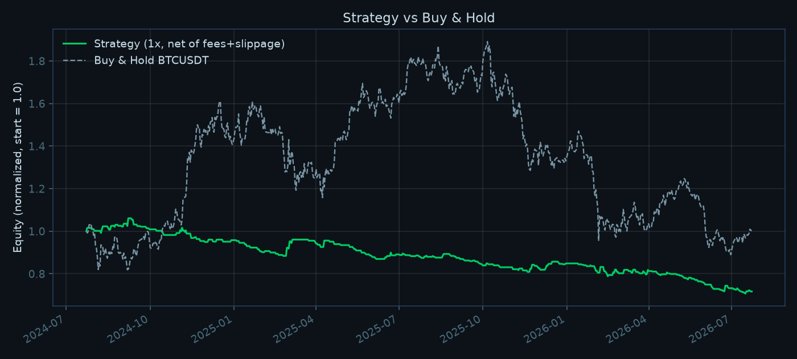
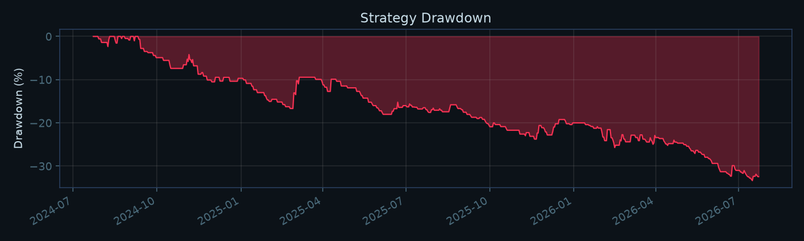

# QTERM — Live BTC Trading Signal Dashboard & Backtesting Engine

A real-time BTC/USDT signal dashboard built on Binance's live WebSocket feed, plus a Python backtesting engine that runs the exact same signal code over two years of history.

**The dashboard** aggregates Binance's raw trade stream into 15-minute candles in the browser and renders price, volume, indicator panels, the current signal and a paper-trade log in Recharts. **The signal engine** — EMA(9/21), RSI(14), MACD(12/26/9) and Bollinger(20) written from scratch and scored into one confluence number, with ATR-scaled stop-loss and take-profit levels — runs server-side and is shared, function for function, by the live stream and the backtester.

This is a systems and research-methodology project, not an alpha claim. **The strategy loses money after realistic costs on the market it was built for**, and the write-up says so plainly. The interesting part is how that was established: cost modelling, a zero-cost control for every run, the same rules across nine markets, and the bugs the backtest caught along the way.

## Architecture

```
                                   ┌─ REST klines: seed history, backfill after reconnect,
                                   │  replace snapshot candles with the final kline
Binance WS  @trade  ───────────────┴─▶ useTradeCandles ─▶ CandleAggregator ─▶ price + volume chart
   (browser)                            (trades → 15m candles)                        │
                                                                                      │ joined per candle
Binance WS  @kline_15m + @ticker ─▶ backend/market_data.py ─▶ backend/signal_engine.py │ by open time
   (backend)                         (backoff, gap-backfill,      │                    ▼
                                      latency)                    └─▶ WS /ws/signals ─▶ useSignalStream ─▶ indicators, signal,
                                                                                                           ATR stop/target, trade log
Binance REST klines (2 years, paginated, parquet-cached)
   └─▶ backend/backtest.py ─▶ backend/signal_engine.py  (SAME functions as live)
                           ─▶ backend/metrics.py        (Sharpe / Sortino / MDD / Profit Factor)
                           ─▶ backend/report.py         (equity curve + drawdown)
```

Two candle sources is deliberate, and each has one job:

- **Signals are computed from Binance's own klines** — the same bars the backtest downloads over REST. A live signal and a backtested signal are built from identical candles, and the indicator math exists exactly once, in `backend/signal_engine.py`. The frontend never computes an indicator.
- **The price display is built from the trade stream**, in the browser, so the forming candle updates on every trade rather than on the exchange's kline push cadence. That aggregation is checked against Binance's own klines (see below), which is what makes it safe to draw the backend's indicator series on top of it.

## Live Dashboard

React + Vite + Recharts. `src/App.jsx` is layout only; all state and I/O lives in custom hooks:

| Hook | Responsibility |
|---|---|
| `useWebSocket` | One socket's lifecycle: connect, exponential backoff with jitter (1s → 30s cap), a stale-connection watchdog (a socket that stays "open" but goes silent is closed and reconnected), and teardown on unmount. Handlers are held in a ref, so a re-render never tears the connection down. |
| `useTradeCandles` | Subscribes to `btcusdt@trade` and aggregates every trade into 15m candles via `src/lib/candles.js`. Seeds history from REST, holds back trades that arrive while that request is in flight, dedupes by Binance trade id after reconnects, backfills missed candles on reconnect, and replaces a REST-snapshot candle with the exchange's final kline once it closes. Aggregation runs per trade; React state is committed at most every 250ms. |
| `useSignalStream` | The backend's `/ws/signals` stream (signal, indicator series, 24h ticker) folded through a reducer. |
| `usePaperTrades` | Forward-only paper trades on actionable signals, using the ATR stop/target the backend generated with the signal. Exits are checked on every trade-stream price and latched once hit. |
| `useHealth`, `useClock` | Backend latency poll (`GET /health`) and the header clock. |

**The paper-trade log is explicitly labeled "not a backtest"** — it's a forward simulation since the tab was opened. The real numbers are in the **Backtest** and **Matrix** tabs, served live from `GET /api/backtest` and `GET /api/matrix`.

### Candle aggregation, verified against the exchange

`src/lib/candles.js` is plain JS with no React and no network, so the module the dashboard runs can be checked directly:

```
node backend/scripts/check_candle_aggregation.mjs            # last 3 closed 15m candles rebuilt from REST aggTrades
node backend/scripts/check_candle_aggregation.mjs --live 4   # the real @trade stream, aggregated into 1m candles for ~4 minutes
```

Both modes compare every candle with Binance's kline for the same open time and fail on any difference in open, high, low or close, or on volume beyond float precision. On the run recorded for this README, three consecutive 15m candles (25,783 to 34,556 fills each) matched exactly, and so did every fully observed 1m candle from the live stream.

Two edge cases are handled rather than ignored:
- **Joining mid-candle.** The first candle comes from a REST snapshot, and live trades are applied on top of it. Prices can't be wrong that way (high/low are max/min, close is the latest trade), but volume can double-count trades that landed between the snapshot and the socket opening. That candle is marked `partial` and swapped for the final kline when it closes.
- **Reconnects.** Candles missed while disconnected are backfilled from REST before buffered trades are applied, and redelivered trades are dropped by trade id.

## Signal Engine (`backend/signal_engine.py`)

Pure standard-library Python — no numpy — so there is never a doubt that a vectorised rewrite changed the arithmetic. Each indicator is scored from −2 to +2 and the four are summed into a composite from −8 to +8:

| Indicator | +2 | +1 | 0 | −1 | −2 |
|---|---|---|---|---|---|
| EMA 9/21 | bullish cross this bar | 9 above 21 | — | 9 below 21 | bearish cross this bar |
| RSI 14 (Wilder) | < 30 | < 45 | 45–55 | > 55 | > 70 |
| MACD 12/26/9 | bullish signal-line cross | above signal, histogram > 0 | otherwise | below signal, histogram < 0 | bearish signal-line cross |
| Bollinger 20, 2σ | close below lower band | below middle | on middle | above middle | above upper band |

Composite ≥ +2 is **BUY**, ≥ +4 **STRONG BUY**; ≤ −2 **SELL**, ≤ −4 **STRONG SELL**. Only the STRONG calls open trades.

**Exits are sized off realised volatility.** When a directional signal is generated, it carries its own stop and target: stop at **1.5 × ATR(14)** from entry, target at **3×** that distance on the other side — a fixed 1:3 reward-to-risk ratio whose price distance widens and narrows with the market. ATR uses Wilder's smoothing, seeded with the mean of the first 14 true ranges.

The 1.5 multiplier was fixed *before* any backtest ran, by matching the previous fixed 0.5% stop on average: BTCUSDT 15m ATR(14) averaged 0.32% of price over the test window, so 1.5 × ATR puts the mean stop at ~0.48%. That keeps the comparison with the old rule about *fixed versus volatility-scaled*, not *tighter versus wider*.

The Python engine is a port of the original frontend implementation. `backend/scripts/check_parity.mjs` + `check_parity.py` run both over 10 synthetic price series and require identical output; the check still passes after ATR was added, which confirms the four confluence indicators were untouched.

## Data Pipeline & Resilience

Implemented in `backend/market_data.py`, and only claims what's actually there:

- **Reconnect with exponential backoff** (capped at 30s) instead of a fixed retry delay.
- **Gap detection + backfill**: on every reconnect, the last known candle's timestamp is compared against a fresh REST fetch; any candles missed while disconnected are pulled via REST before the stream is trusted again (verified in `backend/scripts/test_gap_backfill.py` by simulating a dropped connection and confirming the exact missed candles are recovered).
- **Candles keyed by open time**: an update for the candle already at the end of the buffer replaces it; a newer one appends. (An earlier version appended on the kline's closed flag, which briefly held the forming candle twice, because the REST bootstrap already includes it.)
- **Latency tracking**: every message's exchange event-time (`E`) is diffed against local receive time and exposed at `GET /health` (typically ~200ms on this machine — mostly local clock offset from Binance's server time, not pure network RTT, so treat it as a rough signal rather than a precise measurement).

Not implemented: order-book (depth stream) sequence-number synchronization. The `@trade`, `@ticker` and `@kline` streams used here don't have the out-of-order-delivery failure mode a diff-depth order book stream does, so that's a deliberately separate, larger piece of work this project doesn't claim to solve.

## Backtesting

### Methodology (`backend/backtest.py`)

Strategies are plugins (`backend/strategies/`). A strategy decides only three things — when to enter, which direction, and where its stop and target sit. Everything about turning that intent into a filled trade belongs to the executor, so no strategy can hand itself a favourable fill:

- Signal is read at candle *T*'s close; the trade fills at candle *T+1*'s open. No lookahead — enforced in one place rather than trusted to each strategy.
- The ATR stop distance is fixed on the signal bar and applied to the actual fill; the target is resolved from the realised risk, so reward:risk stays exactly 1:3 even when the fill slips.
- Single position at a time (flat/long/short). A signal firing while a trade is open is dropped, not queued.
- TP/SL are resolved by scanning forward through subsequent candles' high/low. If both would be touched in the same candle, SL is assumed to hit first — conservative, since OHLC candles don't record intra-candle event order.
- Positions are time-stopped after 96 bars (24h at 15m) if neither TP nor SL is hit.
- **Costs are modeled**: a 5bp taker fee per leg and 3bp of slippage per fill on Binance, applied to the unleveraged price return before the leverage multiplier.

**Not modeled**: perpetual funding rate, parameter optimization or walk-forward validation, partial fills, liquidation mechanics ahead of the stop-loss. Every number below should be read with that in mind.

### What the backtest caught

Before trusting any numbers, a 60-day dry run produced **zero trades**. Digging in: the app's entry condition required `strength >= 60`, where `strength = round(|score| / 8 × 100)`. In practice the EMA component only reaches ±2 on the exact crossover bar, and RSI/MACD/Bollinger essentially never *also* hit their ±2 extreme on that same bar — so `|score|` tops out at 4 in real BTCUSDT data, i.e. `strength` tops out at 50. The 60% bar was unreachable: **one trade in two full years** at the original threshold.

This is exactly the kind of thing a real backtest is supposed to surface. Fixed by aligning the actionable condition with what's actually reachable — `STRONG BUY`/`STRONG SELL` only (`strength >= 50`), which is what the old condition could only ever have meant in practice. Both the live dashboard and the backtest use the corrected, shared threshold (`signal_engine.ACTIONABLE_STRENGTH`).

### Results — BTCUSDT 15m

2024-07-23 → 2026-07-23, 1x, 5bp fee + 3bp slippage per fill (16bp round trip). The previous fixed-percentage exits (0.5% stop, 1.5% target) are shown alongside for comparison.

| | **ATR exits (current)** | Fixed 0.5% / 1.5% (previous) |
|---|---|---|
| Trades | 262 | 264 |
| Win rate | 23.7% | 23.5% |
| Sharpe / Sortino | **−1.19** / −2.02 | −1.87 / −4.15 |
| Max drawdown | −33.4% | −38.7% |
| Profit factor | 0.73 | 0.64 |
| Total return | −28.4% | −36.0% |
| Exits (TP / SL / time) | 57 / 199 / 6 | 57 / 197 / 10 |
| **Sharpe, zero cost** | **+0.22** | +0.06 |
| **Profit factor, zero cost** | **1.05** | 1.01 |
| Buy & hold | −2.2% | −2.2% |




**Volatility-scaled exits lose less, and still lose.** The zero-cost control is the number that matters: a gross Sharpe of +0.22 over two years is a t-statistic of about 0.3 — indistinguishable from no edge at all. Costs don't eat a real edge here; there is nothing for them to eat.

Nor should the two columns be read as "ATR improved the strategy by 0.68 Sharpe". It is one comparison on one window, and neither version comes close to profitable.

```
python backtest.py --strategy confluence --symbol BTCUSDT --start 2024-07-23 --end 2026-07-23
```

### Same rules, nine markets

The strategy was built for BTCUSDT. Running the identical rules elsewhere asks whether its behaviour belongs to the signal or to one market. ATR-scaled exits are what make that comparison meaningful at all — a fixed 0.5% stop is days of range on EURUSD 15m and minutes on SOLUSDT, whereas 1.5 × ATR means the same thing on every instrument.

Every run is executed twice: at realistic cost for that venue, and at zero cost. Round-trip cost differs by venue (crypto 16bp, FX 1.7bp, index 0.8bp) because assuming one number across all three would be the single biggest way to get this wrong. One command regenerates the table:

```
python run_matrix.py
```

| Market | Symbol | RT cost | Trades | Win | **Net Sharpe** | Net PF | Net return | **Gross Sharpe** | Gross PF | Buy & hold |
|---|---|---|---|---|---|---|---|---|---|---|
| Crypto (built for) | BTCUSDT | 16bp | 262 | 23.7% | −1.19 | 0.73 | −28.4% | +0.22 | 1.05 | −2.2% |
| Crypto | ETHUSDT | 16bp | 268 | 24.3% | −0.77 | 0.79 | −35.0% | +0.08 | 1.03 | −43.9% |
| Crypto | SOLUSDT | 16bp | 269 | 18.2% | −2.47 | 0.54 | −63.1% | −1.41 | 0.69 | −56.5% |
| Crypto | XRPUSDT | 16bp | 233 | 25.3% | −0.41 | 0.88 | −19.9% | +0.32 | 1.09 | +88.5% |
| FX | EURUSD | 1.7bp | 229 | 24.0% | −0.82 | 0.79 | −3.5% | +0.04 | 1.01 | +4.8% |
| FX | GBPUSD | 1.7bp | 234 | 22.2% | −1.35 | 0.70 | −5.7% | −0.53 | 0.86 | +3.4% |
| FX | USDJPY | 1.7bp | 252 | 26.6% | −0.25 | 0.93 | −1.9% | +0.65 | 1.20 | +4.0% |
| Index CFD | Nasdaq 100 | 0.8bp | 318 | 27.0% | +0.57 | 1.18 | +9.3% | +0.75 | 1.24 | +46.5% |
| Index CFD | S&P 500 | 0.8bp | 320 | 27.5% | +0.54 | 1.18 | +6.5% | +0.77 | 1.27 | +34.8% |

**Seven of nine are net-negative**, including the market the strategy was written for.

The two positive rows are the US index CFDs, and there are three reasons not to read them as an edge. The two indices' daily returns correlate at 0.96 over this window, so they are one observation, not two. A Sharpe of ~0.55 over two years is a t-statistic of about 0.8, far below significance. And with nine markets tried, the best one landing at that level is what chance alone predicts. Both also trail buy-and-hold on the same instrument by 28–37 points.

The right next step for the index result would be to rerun it, unchanged, on a window that hasn't been looked at. This matrix can't serve as that window, because its result is already known.

**A note on leverage.** Earlier in development this ran at 10x (with the previous fixed exits), which produced Sharpe −1.86 and profit factor 0.64 — essentially the same ratios as 1x — but a **−99.7% max drawdown and −99.5% total return**. Leverage doesn't change whether an edge is positive or negative (the scale-invariant ratios barely moved); it changes how violently a *given* edge compounds once the full account is re-risked every trade. A negative edge at 10x is close to guaranteed ruin over 260 trades. Leverage was removed because it obscured the actual result behind a scarier-looking but less informative one.

### Case study: a TradingView strategy that reported +135% on Borsa Istanbul

A published Pine strategy, "Flow Buy/Sell", whose TradingView tester showed **+135.73%** over 8 months on ASTOR (Borsa Istanbul, 15m): 254 trades, 35.83% win rate, profit factor 1.482.

**First, what it actually trades.** The script draws a Kalman-smoothed support/resistance cloud, ATR volatility bands and RSI-weighted bar colouring. None of it reaches the order logic:

```
signalFilter  = input.bool(false, ...)          // default false
buyCondition  = cross_UP and (not signalFilter or close > smoothedSupportZoneEnd)
```

With `signalFilter` false, `not signalFilter` is true and the `or` short-circuits. Both conditions collapse to a bare MACD(20,50,12) cross. Everything else is decoration. So the thing being evaluated is a MACD crossover system that reverses on every cross — implemented here as `strategies/macd_flip.py`.

**Reproduction check.** Trade cadence 1.4/day vs the original's 1.5/day; profit factor 1.56 vs 1.482; win rate 40.0% vs 35.83%. Different sample periods, same mechanism — close enough to trust the comparison.

**Three things the +135.73% doesn't show:**

| | |
|---|---|
| ASTOR buy-and-hold, same window | **+226.3%** |
| The strategy | +135.73% |

The stock nearly tripled. Holding it beat the strategy by ~90 points; the strategy spent the rally flipping in and out of a trend it should have sat in. TradingView draws a buy-and-hold line — it was toggled off in the original screenshot.

Second, commission. The Pine header sets `commission_value=0.05` (0.05%). Real BIST retail cost is roughly 0.2% per side once commission, BSMV and exchange fees are counted. Over 254 trades:

| Assumption | Arithmetic | Capital consumed |
|---|---|---|
| Pine header, 0.05% | 254 × 2 × 0.05% | 25.4% |
| Realistic BIST, 0.2% | 254 × 2 × 0.20% | **101.6%** |

Measured on 15m data, that is the whole result: **+19.7% at the script's assumption, +0.4% at realistic cost** (profit factor 1.56 → 1.07).

Third, half the trades are shorts. Retail short selling of BIST equities is restricted and has been suspended outright for long stretches, and the index cannot be shorted without derivatives. `macd_flip_long` reports the version a Turkish retail account could actually run.

Across 6 BIST symbols × 4 windows × 3 cost assumptions (144 runs, `run_bist.py` → `reports/bist_matrix.json`), only 14 of 48 realistic-cost runs were profitable and only 18 of 48 beat buy-and-hold. The same strategy on the BIST 100 index gives +7.9% over 3 months, -6.8% over 6, and -32.2% over 12 — which is its own lesson about judging a system on a short window.


### On not tuning until it looks good

Every number above comes from the first run of each rule set over the full window. No parameter was adjusted after seeing a result. That matters more than the results themselves: with a handful of thresholds and two years of data, it is trivially easy to search until something shows a positive Sharpe and to have found nothing but an overfit.

Three changes were made during development, each justified independently of its effect on the numbers: the unreachable `strength >= 60` threshold (a bug); removing 10x leverage (it inflated a drawdown without changing the edge); and replacing fixed-percentage exits with ATR-scaled ones, with the multiplier set from average volatility before the backtest was run. The fixed-exit result stays published next to the ATR one rather than being replaced by it.

## Getting Started

**Backend** (Python 3.11+):
```
cd backend
python -m venv .venv
.venv\Scripts\pip install -r requirements.txt
.venv\Scripts\python -m uvicorn main:app --host 127.0.0.1 --port 8123
```
If port 8000 fails to bind on Windows with a permissions error, that's usually a Hyper-V/WSL reserved port range — pick a different port (this project defaults to 8123 for that reason) and update `BACKEND` in `vite.config.js` to match.

**Frontend** (from the repo root, Node 22+):
```
npm install
npm run dev
```
Open the printed `localhost` URL. The dev server proxies `/api`, `/health` and `/ws` to the backend; the trade stream and kline history are fetched from Binance directly.

**Backtests**:
```
cd backend
.venv\Scripts\python backtest.py --strategy confluence --symbol BTCUSDT --start 2024-07-23 --end 2026-07-23
.venv\Scripts\python run_matrix.py
```
`--source dukascopy` gives FX majors and US index CFDs; `--source yahoo` gives equities including Borsa Istanbul (`--symbol XU100.IS`). Candles are cached per (source, symbol, interval, date range) under `backend/data_cache/` as Parquet, and Dukascopy day files are cached individually, so re-runs are fast and an interrupted download resumes.

**Checks**:
```
node backend/scripts/check_candle_aggregation.mjs          # trade -> candle aggregation vs Binance klines
node backend/scripts/check_parity.mjs                      # then:
backend\.venv\Scripts\python backend/scripts/check_parity.py   # Python signal engine vs original JS
backend\.venv\Scripts\python backend/scripts/test_gap_backfill.py
```

## Project Structure

```
qterm/
├── backend/
│   ├── signal_engine.py    # indicators, confluence scoring, ATR exits -- the single source of truth
│   ├── market_data.py      # Binance: REST pagination + live WS, reconnect/backfill/latency
│   ├── main.py             # FastAPI: /health, /api/config, /api/backtest, /api/matrix, WS /ws/signals
│   ├── backtest.py         # strategy-agnostic executor (no-lookahead, costs modeled)
│   ├── run_matrix.py       # confluence across 9 markets, net and gross -> reports/matrix.json
│   ├── run_bist.py         # BIST study: 6 symbols x 4 windows x 3 cost assumptions
│   ├── strategies/
│   │   ├── base.py         #   EntrySignal + Strategy interface
│   │   ├── confluence.py   #   EMA/RSI/MACD/Bollinger confluence with ATR exits
│   │   └── macd_flip.py    #   TradingView "Flow Buy/Sell" == MACD(20/50/12) reversal
│   ├── fx_data.py          # Dukascopy: FX majors + US index CFDs, per-day cache, loud gaps
│   ├── yahoo_data.py       # Yahoo: equities incl. Borsa Istanbul (.IS)
│   ├── metrics.py          # Sharpe / Sortino / Max Drawdown / Profit Factor
│   ├── report.py           # equity curve + drawdown chart generation
│   ├── scripts/            # aggregation check, parity check, gap-backfill test, WS smoke test
│   ├── data_cache/         # cached historical candles (parquet, gitignored)
│   └── reports/            # generated results + charts
├── src/
│   ├── App.jsx             # live view layout
│   ├── hooks/
│   │   ├── useWebSocket.js     # socket lifecycle: backoff, watchdog, teardown
│   │   ├── useTradeCandles.js  # @trade stream -> 15m candles, REST seed/backfill/reconcile
│   │   ├── useSignalStream.js  # backend signal stream reducer
│   │   ├── usePaperTrades.js   # forward paper-trade log with ATR exits
│   │   ├── useHealth.js
│   │   └── useClock.js
│   ├── lib/candles.js      # pure trade -> candle aggregator (shared with the check script)
│   ├── BacktestView.jsx    # equity/drawdown charts, metrics grid
│   ├── MatrixView.jsx      # cross-market results, net vs gross
│   ├── ui.jsx              # shared palette + Panel/ChartTip/Pill
│   └── main.jsx
├── package.json
└── vite.config.js
```

## Tech Stack

Python, FastAPI, WebSockets, pandas, numpy, matplotlib · React (custom hooks), Vite, Recharts · Binance public REST + WebSocket (trade, kline, ticker streams), Dukascopy, Yahoo Finance.

## Disclaimer

Educational/portfolio project. Not financial advice. The strategy loses money after realistic costs on the market it was built for — see Results above.
