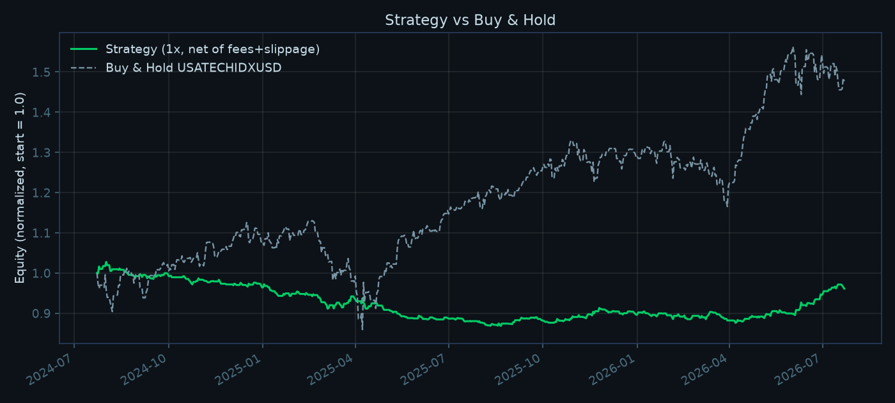
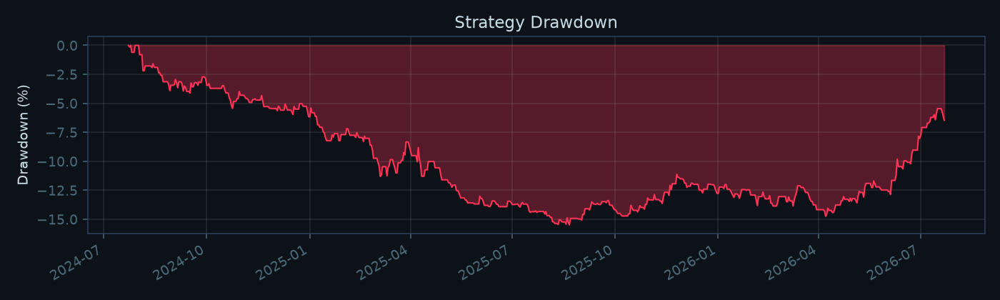

# QTERM — Strategy Backtesting Engine & Live Signal Dashboard

A trading-systems project with two halves.

**A backtesting engine** that evaluates trading strategies under identical, cost-aware, no-lookahead execution rules. Strategies are plugins; markets are plugins. It currently covers crypto (Binance), FX majors and US index CFDs (Dukascopy), and equities including Borsa Istanbul (Yahoo). Five strategies have been run across 13 instruments.

**A live dashboard** where a Python service ingests Binance market data, computes signals server-side, and streams them to a React front end — sharing the exact signal code the backtester runs, so a live result and a backtest result can never describe different strategies.

This is a systems and research-methodology project, not an alpha-discovery claim. **No strategy tested here has a demonstrated edge**, and the write-up is deliberately blunt about that. The interesting content is in *how* that conclusion was reached: the cost modelling, the bugs the backtests caught, and the several times a result looked good until it was checked properly.

## Architecture

```
Binance REST (klines)   ─┐
Binance WS (ticker,      ├─▶ backend/market_data.py ─▶ backend/signal_engine.py ─▶ FastAPI WS /ws/signals ─▶ React (render-only)
            kline_15m)  ─┘        (backoff + reconnect
                                    gap-backfill + latency)

Binance REST (historical klines, paginated + parquet-cached)
        └─▶ backend/backtest.py ──▶ backend/signal_engine.py  (SAME functions as live)
                                ──▶ backend/metrics.py   (Sharpe / Sortino / MDD / Profit Factor)
                                ──▶ backend/report.py    (equity curve + drawdown charts)
```

The signal engine (indicator math + confluence scoring) is written exactly once, in `backend/signal_engine.py`, and used by both the live stream and the backtest. The frontend does not compute anything — it renders whatever the backend sends. This matters: it's the only way a backtest result and a live result can be guaranteed to describe the same strategy. `backend/scripts/check_parity.py` verified this Python port against the original frontend implementation (`src/indicators.js`) across 10 synthetic price series before any of it was trusted, and before `indicators.js` was removed as dead code.

## Live Dashboard

React + Recharts, streaming from the backend over one WebSocket (`/ws/signals`). Shows price with EMA(9,21) and Bollinger(20,2), RSI(14), MACD(12,26,9), the confluence score breakdown, and a live paper-trade log. The header also carries a live latency badge (`GET /health`, polled independently of the signal stream) — the resilience work in the pipeline is otherwise invisible in a screenshot, so it's surfaced directly in the UI.

**The paper-trade log is explicitly labeled "not a backtest"** — it's a forward-only simulation since the tab was opened, useful for watching the strategy react in real time but not a source of performance numbers. The real numbers are one click away: a **Backtest** tab in the header (`src/BacktestView.jsx`) renders the same equity curve, drawdown, and metrics as the Results section below, live from `GET /api/backtest` — not just a static image in this README.

## Data Pipeline & Resilience

Implemented in `backend/market_data.py`, and only claims what's actually there:

- **Reconnect with exponential backoff** (capped at 30s) instead of a fixed retry delay.
- **Gap detection + backfill**: on every reconnect, the last known candle's timestamp is compared against a fresh REST fetch; any candles missed while disconnected are pulled via REST before the stream is trusted again (verified in `backend/scripts/test_gap_backfill.py` by simulating a dropped connection and confirming the exact missed candles are recovered).
- **Latency tracking**: every message's exchange event-time (`E`) is diffed against local receive time and exposed at `GET /health` (typically ~200ms on this machine — mostly local clock offset from Binance's server time, not pure network RTT, so treat it as a rough signal rather than a precise measurement).

Not implemented: order-book (depth stream) sequence-number synchronization. The `@ticker`/`@kline` streams used here don't have a meaningful out-of-order-delivery failure mode the way a diff-depth order book stream does, so that's a deliberately separate, larger piece of work this project doesn't claim to solve.

## Backtesting

### Methodology (`backend/backtest.py`)

Strategies are plugins (`backend/strategies/`). A strategy decides only three things — when to enter, which direction, and where its stop and target sit. Everything about turning that intent into a filled trade belongs to the executor, so no strategy can hand itself a favourable fill and any two strategies are compared under identical assumptions:

- Signal is read at candle *T*'s close; the trade fills at candle *T+1*'s open. No lookahead — enforced in one place rather than trusted to each strategy.
- Single position at a time (flat/long/short). A signal firing while a trade is open is dropped, not queued.
- TP/SL are resolved by scanning forward through subsequent candles' high/low. If both would be touched in the same candle, SL is assumed to hit first — conservative, since OHLC candles don't record intra-candle event order.
- Positions are time-stopped after the strategy's hold limit if neither TP nor SL is hit.
- **Costs are modeled**: a 5bp taker fee per leg and 3bp of slippage per fill, applied to the unleveraged price return before the leverage multiplier — so cost drag scales with leverage the way it actually would on a real leveraged position (fees are charged on notional, and notional = leverage × margin).

**Not modeled**: perpetual funding rate, parameter optimization or walk-forward validation, partial fills, liquidation mechanics ahead of the stop-loss, US market holidays. Every number below should be read with that in mind.

Refactoring the executor out of the strategy was verified to be behaviour-preserving: the confluence strategy reproduces its pre-refactor numbers to every decimal place on the same window (264 trades, Sharpe -1.87337, TP 57 / SL 197 / TIME 10).

### What the backtest caught

Before trusting any numbers, a 60-day dry run produced **zero trades**. Digging in: the app's entry condition required `strength >= 60`, where `strength = round(|score| / 8 × 100)` across 4 indicators each scored in `[-2, 2]`. In practice the EMA component only reaches ±2 on the exact crossover bar, and RSI/MACD/Bollinger essentially never *also* hit their ±2 extreme on that same bar — so `|score|` tops out at 4 in real BTCUSDT data, i.e. `strength` tops out at 50. The 60% bar was unreachable: **one trade in two full years** at the original threshold.

This is exactly the kind of thing a real backtest is supposed to surface. Fixed by aligning the actionable condition with what's actually reachable — `STRONG BUY`/`STRONG SELL` only (`strength >= 50`), which is what the old condition could only ever have meant in practice. Both the live dashboard and the backtest now use the corrected, shared threshold (`signal_engine.ACTIONABLE_STRENGTH`).

### Strategies tested

**1. `confluence`** (15m) — EMA(9/21) + RSI(14) + MACD(12,26,9) + Bollinger(20,2) scored into one confluence number; enters on STRONG BUY/SELL, fixed 0.5% stop / 1.5% target.

**2. `powell_open`** (5m) — the Powell 10:00 ET strategy. Mark the **open price** of the 10:00 America/New_York bar as a single reference level. Wait for price to displace a set distance away from it (default 7bp, derived from the published "15 points" on a ~20,900 Nasdaq 100). Then trade its return to that level, confirmed on a bar close. Stop at the session's most adverse extreme since 10:00, target 2R, one trade per session day, weekends skipped.

The source is a **closed-source** TradingView indicator, [Pro 10:00 Powell Strategy \[NQ ES\]](https://www.tradingview.com/script/24hFxT4t-Pro-10-00-Powell-Strategy-NQ-ES-by-Ash-TheTrader/) by Ash_TheTrader. Its exact thresholds are proprietary, so `backend/strategies/powell_open.py` is a reconstruction of what the author publishes — the module header maps each published claim to the line that implements it, and flags what had to be chosen rather than read off.

One thing the description genuinely does not settle is **direction**. "Trap early breakout traders" argues for fading the displacement; "retest the true open" as support argues for continuation. Both are implemented (`powell_open`, `powell_open_cont`) and both are reported below. Picking one silently would make a published number a coin flip dressed up as a result.

#### A wrong turn worth recording

An earlier version of this section presented `powell_1000` as "the Powell 10am strategy". It was not. It was built from a second-hand AI summary of the strategy rather than the source, and it differs from what the author actually describes in four material ways: it used the 10:00 candle's **high/low range** instead of the **open price**; it triggered on a **close beyond that range** instead of a **fixed displacement distance**; it entered on a separate confirmation candle after a retest rather than on the return to the level; and it took the breakout as real and traded its continuation, where the source's "trap" language points the opposite way.

It was also tested on the wrong markets — BTC and FX majors — when the strategy is explicitly written for NQ and ES.

That earlier code is still in the repo (`strategies/powell_1000.py`, plus `powell_or` for its opening-range reading) because the comparison is the useful part, but it is labelled as what it is: a break-and-retest strategy *inspired by* the description, not the strategy itself. Its results say nothing about whether the real Powell strategy works.

The general lesson is the one this whole project keeps running into: a backtest inherits the quality of its inputs, and a strategy definition is an input. Verifying the source would have cost ten minutes.

The timezone handling is DST-aware throughout, since 10:00 ET is 14:00 UTC in winter and 13:00 UTC in summer; a hardcoded offset would anchor the wrong bar for half the year.

### Everything tested

15 strategy/market combinations, each run twice — once with realistic costs for that venue, once at zero cost. One command regenerates all of it from cached data:

```
python run_matrix.py
```

`BTCUSDT`-style symbols are Binance; `USATECHIDXUSD` / `USA500IDXUSD` are Dukascopy index CFDs standing in for NQ and ES; the rest are FX majors. Window is 2024-07-23 → 2026-07-23 throughout, 1x, no compounding tricks. Round-trip cost differs by venue (crypto 16bp, FX 1.7bp, index 0.8bp) because assuming one number across all three would be the single biggest way to get this wrong.

| Strategy | Symbol | TF | RT cost | Trades | Win | **Net Sharpe** | Net PF | Net return | **Gross Sharpe** | **Gross PF** | Buy & hold |
|---|---|---|---|---|---|---|---|---|---|---|---|
| *Powell 10:00 — the market it was written for* |||||||||||
| `powell_open` | Nasdaq 100 | 5m | 0.8bp | 348 | 37.1% | -0.24 | 0.94 | -3.9% | **-0.03** | **0.99** | +46.5% |
| `powell_open_cont` | Nasdaq 100 | 5m | 0.8bp | 363 | 32.8% | -0.62 | 0.84 | -8.8% | -0.46 | 0.88 | +46.5% |
| `powell_open` | S&P 500 | 5m | 0.8bp | 333 | 36.3% | -0.46 | 0.90 | -5.3% | -0.23 | 0.95 | +34.8% |
| `powell_open_cont` | S&P 500 | 5m | 0.8bp | 333 | 37.2% | -0.74 | 0.80 | -7.7% | -0.54 | 0.84 | +34.8% |
| *Powell 10:00 — markets it was not written for* |||||||||||
| `powell_open` | BTCUSDT | 5m | 16bp | 395 | 36.5% | -1.57 | 0.73 | -37.8% | +0.67 | 1.15 | -2.1% |
| `powell_open` | EURUSD | 5m | 1.7bp | 256 | 41.0% | -0.55 | 0.87 | -2.5% | +0.45 | 1.12 | +4.8% |
| *Mislabelled reconstruction (wrong rules — see above)* |||||||||||
| `powell_1000` | BTCUSDT | 5m | 16bp | 290 | 37.6% | -1.09 | 0.78 | -26.2% | +0.58 | 1.15 | -2.1% |
| `powell_1000` | ETHUSDT | 5m | 16bp | 288 | 41.0% | -0.07 | 0.98 | -4.8% | +1.18 | 1.34 | -43.8% |
| `powell_1000` | SOLUSDT | 5m | 16bp | 303 | 38.3% | -0.53 | 0.89 | -21.4% | +0.70 | 1.18 | -56.3% |
| `powell_1000` | XRPUSDT | 5m | 16bp | 299 | 34.4% | -0.63 | 0.86 | -25.9% | +0.42 | 1.11 | +88.4% |
| `powell_1000` | EURUSD | 5m | 1.7bp | 306 | 37.9% | -1.45 | 0.72 | -5.9% | -0.14 | 0.97 | +4.8% |
| `powell_1000` | GBPUSD | 5m | 1.7bp | 304 | 37.8% | -0.81 | 0.84 | -3.3% | +0.63 | 1.15 | +3.4% |
| `powell_1000` | USDJPY | 5m | 1.7bp | 297 | 32.0% | -1.61 | 0.65 | -7.9% | -0.52 | 0.87 | +4.0% |
| `powell_or` | BTCUSDT | 5m | 16bp | 299 | 40.8% | -1.31 | 0.72 | -39.2% | +0.02 | 0.99 | -2.1% |
| *TA confluence baseline* |||||||||||
| `confluence` | BTCUSDT | 15m | 16bp | 264 | 23.5% | -1.87 | 0.64 | -36.0% | +0.06 | 1.01 | -2.2% |

**Fifteen for fifteen net-negative.** No configuration, on any market, at any cost assumption, produced a positive net result.

The gross column is where the interesting pattern is, and it points the wrong way for anyone hoping the strategy works. Every run on a market the strategy was *not* designed for shows a positive gross Profit Factor (1.11–1.34). Every run on the market it *was* designed for shows roughly 1.00 or below. If the 10:00 New York open genuinely carried information, that ordering would be reversed. The most economical explanation is that the crypto and FX gross numbers are sampling noise from a strategy with no edge, and the index numbers — where the mechanism should be strongest and where two years is a reasonable sample — are what no edge actually looks like.

### Results — the real strategy on the market it was written for

`powell_open` on the Nasdaq 100 and S&P 500 index CFDs (the closest freely available proxies for NQ and ES), 2024-07-23 → 2026-07-23, 1x, 0.1bp fee + 0.3bp slippage per fill (index futures are cheap to trade — 0.8bp round trip):

| | NDX fade | NDX continuation | SPX fade | SPX continuation |
|---|---|---|---|---|
| Trades | 348 | 363 | 333 | 333 |
| Win rate | 37.1% | 32.8% | 36.3% | 37.2% |
| Sharpe (net) | **-0.24** | -0.62 | -0.46 | -0.74 |
| Profit Factor (net) | 0.94 | 0.84 | 0.90 | 0.80 |
| Total return (net) | -3.9% | -8.8% | -5.3% | -7.7% |
| **Sharpe (zero-cost)** | **-0.03** | -0.46 | -0.23 | -0.54 |
| **Profit Factor (zero-cost)** | **0.99** | 0.88 | 0.95 | 0.84 |
| Exit reasons | 88/195/65 | 97/234/32 | 81/184/68 | 110/203/20 |

**There is no edge here, gross or net.** The best of the four — the fade reading on the Nasdaq — has a zero-cost Profit Factor of 0.99 and an annualized Sharpe of -0.03 over two years (t ≈ -0.04). That is not a small edge being eaten by costs; it is nothing at all. Costs on index futures are only ~0.8bp round trip, so unlike the crypto tests below, execution cost is not what decides the outcome.

The fade reading beats the continuation reading on both indices, which is mild evidence that "trap early breakout traders" was the intended direction. It is not enough evidence to claim it.




```
python backtest.py --strategy powell_open --source dukascopy --symbol USATECHIDXUSD --start 2024-07-23 --end 2026-07-23
```

### The earlier, mislabelled tests — and why they looked better

The `powell_1000` reconstruction (wrong rules, wrong markets — see above) produced *better-looking* gross numbers than the faithful version does on the right market:

| | `powell_1000` on BTCUSDT | `powell_open` on Nasdaq 100 |
|---|---|---|
| Profit Factor, zero-cost | **1.15** | 0.99 |
| Sharpe, zero-cost | **+0.58** | -0.03 |
| Profit Factor, net | 0.78 | **0.94** |

That inversion is the most useful thing in this section. A strategy built from a garbled description, run on markets it was never designed for, showed a gross Profit Factor of 1.15 across four crypto pairs — and it was noise. The faithful version on the correct instrument shows nothing. If the crypto result had been taken at face value, the conclusion would have been "there's an edge here, it just needs cheaper execution," and it would have been wrong.

For completeness, the `powell_1000` results across seven instruments (all net-negative; gross Profit Factor in brackets): ETHUSDT 1.34, SOLUSDT 1.18, BTCUSDT 1.15, GBPUSD 1.15, XRPUSDT 1.11, EURUSD 0.97, USDJPY 0.87. Crypto majors correlate ~0.8, so those four are closer to one and a half independent observations than four, and the FX three disagree in sign.

### The confluence strategy, for reference

`BTCUSDT` 15m, same window, 1x, 5bp fee + 3bp slippage:

| Metric | `confluence` |
|---|---|
| Trades | 264 |
| Win rate | 23.5% |
| Sharpe / Sortino | -1.87 / -4.15 |
| Max Drawdown | -38.7% |
| Profit Factor | 0.64 |
| Total return | -36.0% |
| Exit reasons | TP 57 · SL 197 · TIME 10 |

A 23.5% win rate against a 1:3 risk/reward band needs roughly 25% just to break even before costs — so on paper this should be negative gross too. It isn't quite: the zero-cost control gives Profit Factor 1.01 and Sharpe +0.06, i.e. flat. The back-of-envelope breakeven assumes every trade resolves at exactly TP or SL, and 10 of the 264 resolve on the time stop instead. An earlier draft of this README asserted "negative gross as well as net" from that arithmetic without running the control; the matrix run below contradicted it. Reasoning about what a backtest would show is not a substitute for running it.

No strategy tested in this repo has a demonstrated edge. That is the finding, and it is reported as-is rather than tuned until it looked better.

**A note on leverage.** This ran at 10x through most of this project's development, which produced Sharpe -1.86 and Profit Factor 0.64 — both essentially unchanged from the 1x numbers above — but a **-99.7% max drawdown and -99.5% total return**: an account wipeout rather than a slow bleed. Putting the two runs side by side is itself the useful part: leverage doesn't change whether an edge is positive or negative (the scale-invariant ratios barely moved), it changes how violently a *given* edge compounds once you're re-risking the full account every trade. A negative edge at 10x is close to guaranteed ruin over 264 trades; the same edge at 1x is something a trader could stay solvent under, while still losing to buy-and-hold. Leverage was removed here because it was obscuring the actual result behind a scarier-looking but less informative one.

### Case study: a TradingView strategy that reported +135% on Borsa Istanbul

A published Pine strategy, "Flow Buy/Sell", whose TradingView tester showed **+135.73%** over 8 months on ASTOR (Borsa Istanbul, 15m): 254 trades, 35.83% win rate, profit factor 1.482.

**First, what it actually trades.** The script draws a Kalman-smoothed support/resistance cloud, ATR volatility bands and RSI-weighted bar colouring. None of it reaches the order logic:

```
signalFilter  = input.bool(false, ...)          // default false
buyCondition  = cross_UP and (not signalFilter or close > smoothedSupportZoneEnd)
```

With `signalFilter` false, `not signalFilter` is true and the `or` short-circuits. Both conditions collapse to a bare MACD(20,50,12) cross. Everything else is decoration. So the thing being evaluated is a MACD crossover system that reverses on every cross — implemented here as `strategies/macd_flip.py`.

**Reproduction check.** Trade cadence 1.4/day vs the original's 1.5/day; profit factor 1.56 vs 1.482; win rate 40.0% vs 35.83%. Different sample periods, same mechanism — close enough to trust the comparison.

**Three things the +135.73% doesn't show:**

| | |
|---|---|
| ASTOR buy-and-hold, same window | **+226.3%** |
| The strategy | +135.73% |

The stock nearly tripled. Holding it beat the strategy by ~90 points; the strategy spent the rally flipping in and out of a trend it should have sat in. TradingView draws a buy-and-hold line — it was toggled off in the original screenshot.

Second, commission. The Pine header sets `commission_value=0.05` (0.05%). Real BIST retail cost is roughly 0.2% per side once commission, BSMV and exchange fees are counted. Over 254 trades:

| Assumption | Arithmetic | Capital consumed |
|---|---|---|
| Pine header, 0.05% | 254 × 2 × 0.05% | 25.4% |
| Realistic BIST, 0.2% | 254 × 2 × 0.20% | **101.6%** |

Measured on 15m data, that is the whole result: **+19.7% at the script's assumption, +0.4% at realistic cost** (profit factor 1.56 → 1.07).

Third, half the trades are shorts. Retail short selling of BIST equities is restricted and has been suspended outright for long stretches, and the index cannot be shorted without derivatives. `macd_flip_long` reports the version a Turkish retail account could actually run.

Across 6 BIST symbols × 4 windows × 3 cost assumptions (144 runs, `run_bist.py` → `reports/bist_matrix.json`), only 14 of 48 realistic-cost runs were profitable and only 18 of 48 beat buy-and-hold. The same strategy on the BIST 100 index gives +7.9% over 3 months, -6.8% over 6, and -32.2% over 12 — which is its own lesson about judging a system on a short window.

### On not tuning until it looks good

Every number above comes from the first run of each strategy's stated rules over the full window. No parameter was adjusted after seeing a result. That matters more than the results themselves: with a handful of thresholds and two years of data, it is trivially easy to search until something shows a positive Sharpe and to have found nothing but an overfit.

Where a rule genuinely had two defensible readings — the anchor level, the trade direction — both were implemented and both are published, rather than the better-looking one being kept. Three changes made during development were *fixes*, not tuning: the unreachable `strength >= 60` threshold; removing 10x leverage, which inflated a drawdown number without changing the underlying edge; and a hold period too short for the opening-range variant's target distance, which was closing 54% of its trades on the time stop before they could resolve.

The correct next step for a strategy worth pursuing is an in-sample/out-of-sample split (tune on the first 18 months, report whatever the final 6 months give). Nothing here has cleared the bar to justify that.

Reproduce with:
```
python backtest.py --strategy powell_open --source dukascopy --symbol USATECHIDXUSD --start 2024-07-23 --end 2026-07-23
```
`--strategy` takes any of `powell_open`, `powell_open_cont`, `confluence`, `powell_1000`, `powell_or`. `--source dukascopy` gives FX majors and US index CFDs; omit it for Binance crypto. `--interval` and `--max-hold-bars` default to each strategy's own timeframe. Candles are cached per (source, symbol, interval, date range) under `backend/data_cache/` as Parquet, and Dukascopy day files are cached individually, so re-runs after the first are fast and an interrupted download resumes.

## Getting Started

**Backend** (Python 3.11+; a venv keeps this isolated from any other Python install):
```
cd backend
python -m venv .venv
.venv\Scripts\pip install -r requirements.txt
.venv\Scripts\python -m uvicorn main:app --host 127.0.0.1 --port 8123
```
If port 8000 fails to bind on Windows with a permissions error, that's usually a Hyper-V/WSL reserved port range — pick a different port (this project defaults to 8123 for that reason) and update `BACKEND` in `vite.config.js` to match.

**Frontend** (from the repo root):
```
npm install
npm run dev
```
Open the printed `localhost` URL. The dev server proxies `/api` and `/ws` to the backend (see `vite.config.js`).

**Backtest**:
```
cd backend
.venv\Scripts\python backtest.py --symbol BTCUSDT --interval 1h --start 2023-07-23 --end 2025-07-23
```
`--interval` accepts any Binance kline interval; the headline result above uses 15m to match the live strategy exactly rather than a separately-tuned timeframe.

## Project Structure

```
qterm/
├── backend/
│   ├── signal_engine.py   # indicator math + confluence scoring — the single source of truth
│   ├── market_data.py     # Binance: REST pagination + live WS, reconnect/backfill/latency
│   ├── fx_data.py          # Dukascopy: FX majors + US index CFDs, per-day cache, loud gaps
│   ├── yahoo_data.py       # Yahoo: equities incl. Borsa Istanbul (.IS)
│   ├── run_bist.py         # BIST study: 6 symbols x 4 windows x 3 cost assumptions
│   ├── main.py             # FastAPI app, /health, /api/config, /api/backtest, WS /ws/signals
│   ├── backtest.py         # strategy-agnostic executor (no-lookahead, costs modeled)
│   ├── run_matrix.py       # runs every strategy x market combination -> reports/matrix.json
│   ├── strategies/         # pluggable strategies -- add a module, run --strategy <name>
│   │   ├── base.py         #   EntrySignal + Strategy interface
│   │   ├── confluence.py   #   EMA/RSI/MACD/Bollinger confluence
│   │   ├── powell_open.py  #   Powell 10:00 ET (faithful) -- fade + continuation readings
│   │   ├── powell_1000.py  #   earlier mislabelled reconstruction, kept for the comparison
│   │   └── macd_flip.py    #   TradingView "Flow Buy/Sell" == MACD(20/50/12) reversal
│   ├── metrics.py          # Sharpe / Sortino / Max Drawdown / Profit Factor
│   ├── report.py           # equity curve + drawdown chart generation
│   ├── scripts/            # parity check (vs the original JS), gap-backfill test
│   ├── data_cache/         # cached historical klines (parquet, gitignored)
│   └── reports/            # generated metrics.json + charts
├── src/                     # React + Vite dashboard (render-only, no local computation)
│   ├── App.jsx              # live view: WS client, health badge, view toggle
│   ├── BacktestView.jsx     # backtest view: equity/drawdown charts, metrics grid
│   ├── MatrixView.jsx       # research view: every strategy x market run, net vs gross
│   ├── ui.jsx               # shared palette + Panel/ChartTip/Pill used by all views
│   └── main.jsx
├── package.json
└── vite.config.js
```

## Tech Stack

Python, FastAPI, WebSockets, pandas, numpy, matplotlib · React, Vite, Recharts · Binance public REST + WebSocket market data.

## Disclaimer

Educational/portfolio project. Not financial advice. The backtested strategy loses money after realistic costs — see Results above.
